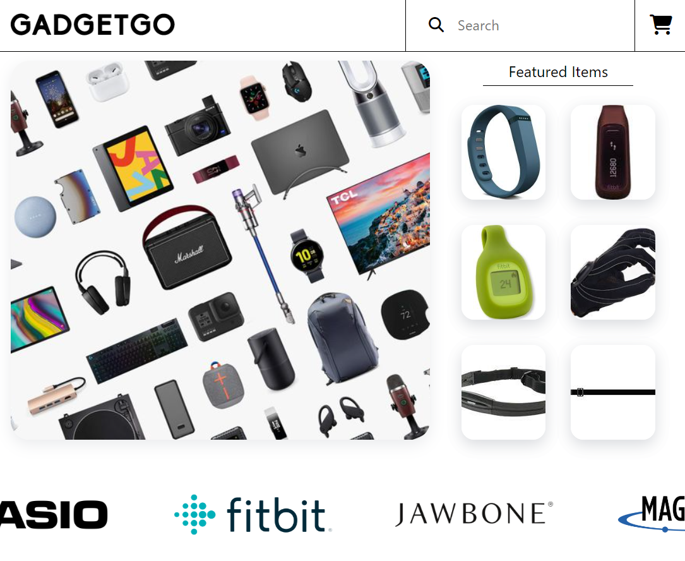

# Wearables E-Commerce Project

In a team of five, we built an e-commerce website that will showcase wearable technology. The client believes that wearable tech is the way of the future! It is a functional e-commerce website where users can come in and shop around for the tech they want.

## API endpoints
  * "/api/get-items" // get all the items
  * "/api/item/:itemId" // get one item and its details
  * "/api/get-companies"    // get all the companies
  * "/api/company/:companyId" // get one company and its details
  * "/api/cart" // get the cart with all the items in it
  * "/api/add-item-to-cart" // add item to the cart
  * "/api/delete-item/:itemId" //delete 1 item from the cart
  * "/api/delete-AllItems" //delete all item from the cart
  * "/api/update-item-quantity" // update item quantity in the cart
  * "/api/purchase-item" // purchasing an item
  * "/api/purchases" // get all purchases made
  * "/api/purchase/:purchaseId" // get one purchase depending on the id

## Technology Used
### Frontend
* Create React APP // Creating a React app and its environment
* React hooks // Management of UI components
* React Router // Management of router
* styled-components // Style with CSS-in-JS components
* fetch // Communicating with back-end server (Node.js) via API
* Vercel // Deployed via Vercel

### Backend
* Node.js // Backend environment
* MongoDB // Storing data
* Vercel // Deployed via Vercel
